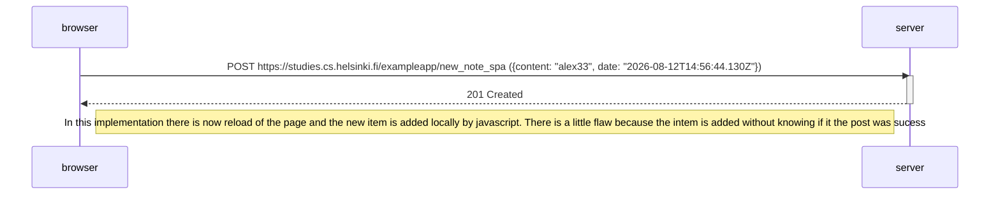

```mermaid
sequenceDiagram
    participant browser
    participant server

    browser->>server: POST https://studies.cs.helsinki.fi/exampleapp/new_note_spa ({content: "alex33", date: "2026-08-12T14:56:44.130Z"})
    activate server
    server-->>browser: 201 Created
    deactivate server

     Note right of browser: In this implementation there is now reload of the page and the new item is added locally by javascript. There is a little flaw because the intem is added without knowing if it the post was sucess
```